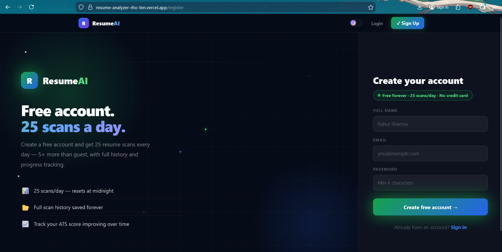
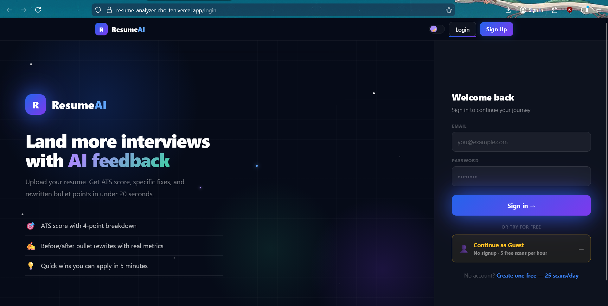
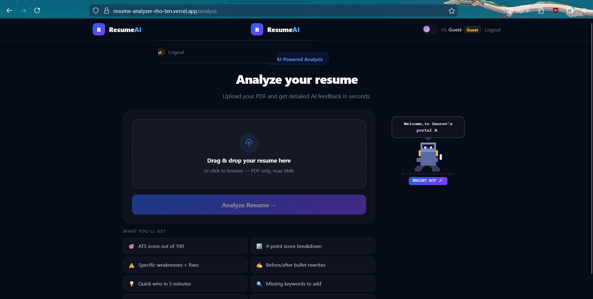
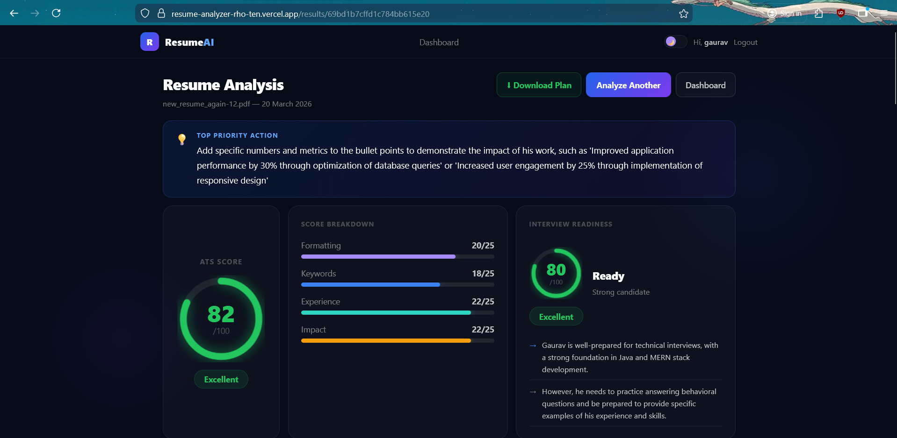

<div align="center">


<br/>
<br/>

```
██████╗ ███████╗███████╗██╗   ██╗███╗   ███╗███████╗  █████╗  ██╗
██╔══██╗██╔════╝██╔════╝██║   ██║████╗ ████║██╔════╝  ██╔══██╗██║
██████╔╝█████╗  ███████╗██║   ██║██╔████╔██║█████╗    ███████║██║
██╔══██╗██╔══╝  ╚════██║██║   ██║██║╚██╔╝██║██╔══╝    ██╔══██║██║
██║  ██║███████╗███████║╚██████╔╝██║ ╚═╝ ██║███████╗  ██║  ██║██║
╚═╝  ╚═╝╚══════╝╚══════╝ ╚═════╝ ╚═╝     ╚═╝╚══════╝  ╚═╝  ╚═╝╚═╝
```

### 🗡️ AI-Powered Resume Analyzer — Built with MERN + Groq LLaMA 3.3

**Upload your resume. Get brutally honest AI feedback. Land more interviews.**

<br/>

[](https://resume-analyzer-rho-ten.vercel.app)

<br/>

---

</div>

## ✨ What It Does

ResumeAI analyzes your PDF resume using **LLaMA 3.3 70B** (via Groq) and gives you the kind of feedback a senior recruiter at a top company would give — specific, harsh, and actionable.

| Feature | Description |
|---------|-------------|
| 🎯 **ATS Score** | Realistic 0–100 score with 4-point breakdown (Formatting, Keywords, Experience, Impact) |
| ✍️ **Bullet Rewrites** | Your weak bullets rewritten with action verbs, metrics, and clear impact |
| ⚠️ **Weaknesses & Fixes** | Specific problems in your resume with exact fixes and rewritten examples |
| 💡 **Quick Wins** | Changes you can make in 5 minutes that boost your score by 10–15 points |
| 🔍 **Missing Keywords** | Keywords ATS systems look for that your resume is missing |
| 📊 **Section Scores** | Individual scores for Summary, Experience, Projects, Skills, Education |
| 🗺️ **Role Alignment** | Which roles you're ready for now vs which are a stretch |
| ⬇️ **Action Plan PDF** | Download a complete formatted action plan to follow |

<br/>

## 📸 Screenshots

<div align="center">
  <h3>Project Walkthrough</h3>

| **Registration** | **Dashboard** |
| :---: | :---: |
|  |  |
| **Analyze Tool** | **AI Results** |
|  |  |

</div>
<br/>

## 🛠️ Tech Stack

### Frontend


### Backend


### AI & Tools


### Deployment


<br/>

## 🏗️ Project Structure

```
resume-analyzer/
├── client/                          # React frontend (Vite)
│   └── src/
│       ├── api/axios.js             # Axios instance with JWT interceptor
│       ├── context/
│       │   ├── AuthContext.jsx      # Global auth state (localStorage)
│       │   └── ThemeContext.jsx     # Dark/light theme toggle
│       ├── pages/
│       │   ├── Login.jsx            # Login + Guest access
│       │   ├── Register.jsx         # Sign up
│       │   ├── Dashboard.jsx        # Scan history + progress chart
│       │   ├── Analyze.jsx          # PDF upload + Knight mascot
│       │   └── Results.jsx          # Full AI analysis display
│       └── utils/downloadPlan.js    # Action plan PDF generator
│
└── server/                          # Node/Express backend
    ├── models/
    │   ├── User.js                  # User schema (guest + registered)
    │   └── Resume.js                # Resume scan schema (rich fields)
    ├── routes/
    │   ├── auth.js                  # Register, Login, Guest session
    │   └── resume.js                # Upload, History, Get, Delete
    ├── middleware/authMiddleware.js  # JWT verification
    ├── services/geminiService.js    # Groq AI integration + prompt
    └── index.js                     # Express server + CORS + MongoDB
```

<br/>

## ⚡ Key Features Deep Dive

### 🔐 Authentication
- **JWT-based** auth with 7-day tokens for registered users
- **Guest mode** — no signup required, 5 scans/hour
- **Rate limiting** — 25 scans/day for registered users, resets at midnight
- Token stored in `localStorage`, auto-attached via Axios interceptor

### 🤖 AI Analysis (The Core)
The Groq prompt instructs LLaMA 3.3 70B to act as a senior technical recruiter with 15 years of experience. It:
- References **actual content** from your resume (names, projects, tech)
- Gives **realistic scores** (most freshers score 35–55, not 80+)
- Returns structured **JSON** with 15+ fields parsed and displayed

### 📈 Score History Chart
- Canvas-based bezier curve chart (no external chart library)
- Shows last 10 scans with dates
- Color-coded dots per score range
- Adapts to dark/light theme

### 🌙 Dark / Light Theme
- CSS variables for all colors
- Persisted in `localStorage`
- Smooth transitions on all elements
- Animations visible in both modes

<br/>

## 🚀 Running Locally

### Prerequisites
- Node.js 18+
- MongoDB Atlas account (free)
- Groq API key (free at [console.groq.com](https://console.groq.com))

### 1. Clone the repo
```bash
git clone https://github.com/roygaurav007/resume-analyzer.git
cd resume-analyzer
```

### 2. Setup the backend
```bash
cd server
npm install
```

Create `server/.env`:
```env
PORT=5000
MONGODB_URI=your_mongodb_atlas_connection_string
JWT_SECRET=your_long_random_secret_key
GROQ_API_KEY=your_groq_api_key
FRONTEND_URL=http://localhost:5173
```

Start the server:
```bash
npm run dev
```
You should see: `MongoDB connected successfully` and `Server running on port 5000`

### 3. Setup the frontend
```bash
cd ../client
npm install
npm run dev
```

Visit: **http://localhost:5173**

<br/>

## 🌐 Deployment

| Service | Platform | Config |
|---------|----------|--------|
| Frontend | Vercel | Root: `client/`, Framework: Vite |
| Backend | Render | Root: `server/`, Start: `node index.js` |
| Database | MongoDB Atlas | Network: `0.0.0.0/0` for Render |

**Environment variables needed on Render:**
```
MONGODB_URI, JWT_SECRET, GROQ_API_KEY, FRONTEND_URL
```

**Environment variables needed on Vercel:**
```
VITE_API_URL=https://your-render-url.onrender.com/api
```

<br/>

## 📡 API Reference

| Method | Endpoint | Auth | Description |
|--------|----------|------|-------------|
| `POST` | `/api/auth/register` | ❌ | Create account |
| `POST` | `/api/auth/login` | ❌ | Login, get JWT |
| `POST` | `/api/auth/guest` | ❌ | Guest session (2hr JWT) |
| `POST` | `/api/resume/upload` | ✅ | Upload PDF → analyze → save |
| `GET` | `/api/resume/history` | ✅ | Get all user's scans |
| `GET` | `/api/resume/:id` | ✅ | Get single scan result |
| `DELETE` | `/api/resume/:id` | ✅ | Delete a scan |
| `GET` | `/health` | ❌ | Server health check |

<br/>

## 🎯 What I Learned Building This

- **Full MERN stack** from scratch — auth, file upload, DB design, API design
- **Prompt engineering** — structuring AI prompts to return consistent, useful JSON
- **Rate limiting** logic without external libraries
- **Canvas API** for building a custom chart without Chart.js
- **CORS debugging** across Vercel preview URLs and Render
- **CSS variables** for a proper dark/light theme system
- **Mobile-first** responsive design without a component library

<br/>

## 🗡️ The Knight

ResumeAI features a pixel art knight mascot built entirely in SVG — no images, no assets. He animates with a walking frame loop, bobs up and down, and gives you typewriter-style messages while your resume is being reviewed.

<br/>

## 📄 License

MIT — feel free to fork, clone, and build on this.

<br/>

<div align="center">

**Built with ☕ and determination**

⭐ Star this repo if you found it useful!

[](https://github.com/roygaurav007/resume-analyzer)
[](https://resume-analyzer-rho-ten.vercel.app)

</div>
